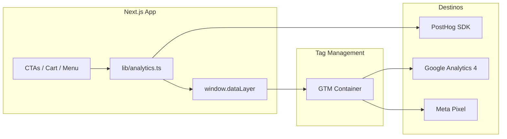
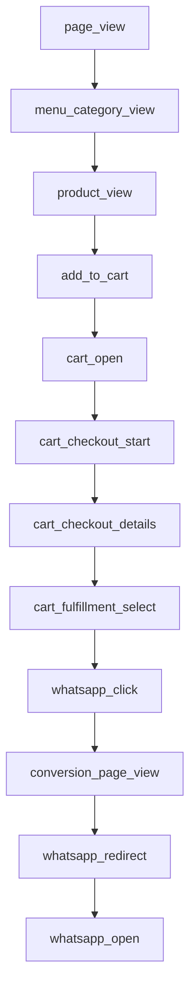

# Medición digital — Mad Dogos

> **Documento canónico.** Cualquier LLM o desarrollador que modifique funcionalidad del sitio **debe leer esto primero** y mantener la instrumentación al día.
>
> Docs relacionadas:
> - [Configuración GTM](./analytics-gtm-setup.md)
> - [Dashboards PostHog](./analytics-posthog-dashboards.md)
> - [Checklist QA](./analytics-qa.md)

---

## Objetivo del negocio

Mad Dogos convierte visitas web en **pedidos por WhatsApp**. No hay checkout con pago online ni confirmación backend — el proxy de conversión es **`whatsapp_redirect`** (usuario llegó a abrir WhatsApp con intención de pedir).

La medición debe responder:

1. ¿Cuántas personas llegan al funnel de pedido?
2. ¿En qué paso abandonan (menú → carrito → checkout → WA)?
3. ¿Qué fuentes traen más conversiones (`src`, UTMs, QR)?
4. ¿Cuántas consultas de renta de carrito generamos?

---

## Arquitectura agnóstica

Un solo contrato de eventos en código. Múltiples destinos vía dataLayer + SDK.



### Principios (no negociables)

1. **Una sola fuente de verdad:** todo pasa por `track()` en [`lib/analytics.ts`](../lib/analytics.ts).
2. **Nunca** llamar `posthog.capture()` directo en componentes (excepto alias legacy documentados).
3. **dataLayer primero:** cada evento hace `window.dataLayer.push()` para GTM/GA4/Meta.
4. **Intención ≠ conversión:** separar `whatsapp_click` (intención) de `whatsapp_redirect` (conversión).
5. **Atribución en todos los eventos:** UTMs y `landing_src` se adjuntan automáticamente desde `sessionStorage`.
6. **Sin acoplar a GA4 en código:** el mapeo a `view_item`, `generate_lead`, etc. ocurre en GTM, no en React.

---

## Stack y variables de entorno

| Herramienta | Rol | Integración |
|-------------|-----|-------------|
| **PostHog** | Product analytics, funnels, session replay | SDK directo (`posthog-js`) — más confiable en SPA |
| **GTM** | Tag hub | Script en `layout.tsx`, consume `dataLayer` |
| **GA4** | Informes estándar, audiencias remarketing | Tags en GTM |
| **Meta Pixel** | Ads / remarketing | Tags en GTM |

```bash
# .env.local / Vercel
NEXT_PUBLIC_POSTHOG_KEY=phc_...
NEXT_PUBLIC_POSTHOG_HOST=https://us.i.posthog.com
NEXT_PUBLIC_GTM_ID=GTM-XXXXXXX
NEXT_PUBLIC_WA_NUMBER=526673872070
```

---

## API de medición en código

### Funciones principales

| Función | Archivo | Uso |
|---------|---------|-----|
| `track(event)` | `lib/analytics.ts` | Emitir cualquier evento tipado |
| `trackPageView(path, search)` | `lib/analytics.ts` | Pageviews (llamado por provider) |
| `captureSessionAttribution(params)` | `lib/analytics.ts` | Primera visita — UTMs + `?src=` |
| `getAttribution()` | `lib/analytics.ts` | Leer atribución persistida |

### Tipos de eventos

Contrato completo en [`lib/analytics-events.ts`](../lib/analytics-events.ts) — **union discriminada por `event`**. Al agregar un evento nuevo:

1. Añadir tipo en `analytics-events.ts`
2. Instrumentar con `track()`
3. Documentar aquí y en GTM si aplica
4. Actualizar checklist QA

### Helpers de carrito

[`lib/analytics-cart.ts`](../lib/analytics-cart.ts):

- `cartAnalyticsSnapshot(lines)` → `{ cart_value, cart_items }`
- `productAnalyticsProps(item)` → `{ product_id, product_name, category, price }`

### Componentes reutilizables

| Componente | Archivo | Evento |
|------------|---------|--------|
| `TrackedCtaLink` | `components/analytics/tracked-cta-link.tsx` | `cta_click` |
| `TrackedWhatsAppLink` | idem | `whatsapp_click` |
| `TrackedOutboundLink` | idem | `outbound_click` |
| `RentalInquiryLink` | idem | `rental_inquiry_click` + `whatsapp_click` |
| `OrderWhatsAppButton` | `components/order-whatsapp-button.tsx` | Wrapper con tracking |
| `HomeHeroCta` / `HomeFinalCta` | `components/analytics/home-ctas.tsx` | `cta_click` |

### Providers e infraestructura

| Archivo | Responsabilidad |
|---------|-----------------|
| `components/providers/analytics-provider.tsx` | Pageviews + atribución de sesión |
| `components/providers/posthog-provider.tsx` | Solo init de PostHog (no pageviews) |
| `components/gtm.tsx` | Script GTM condicionado a `NEXT_PUBLIC_GTM_ID` |
| `app/layout.tsx` | Monta GTM + PostHog + AnalyticsProvider |

---

## Modelo de conversión actual

> ⚠️ El sitio evolucionó a **carrito-first**. Ya no hay botón "Pedir" por producto individual — el funnel principal es menú → carrito → checkout → WhatsApp.

### Funnel 1 — Pedido por carrito (KPI principal)



| Paso | Evento | Dónde se dispara | Props clave |
|------|--------|------------------|-------------|
| 1 | `menu_category_view` | `menu-view.tsx` — tab click o scroll-spy | `category`, `interaction` |
| 2 | `product_view` | `product-detail-sheet.tsx` — al abrir sheet | `product_id`, `product_name`, `category`, `price` |
| 3 | `add_to_cart` | `cart-provider.tsx` — al agregar línea | `product_*`, `quantity`, `cart_value`, `cart_items` |
| 4 | `remove_from_cart` | `cart-provider.tsx` — al quitar/decrementar a 0 | idem |
| 5 | `cart_open` | `cart-ui.tsx` — abrir CartSheet | `cart_value`, `cart_items` |
| 6 | `cart_checkout_start` | `cart-sheet.tsx` — Continuar paso 1→2 | `cart_value`, `cart_items` |
| 7 | `cart_checkout_details` | `cart-sheet.tsx` — Continuar paso 2→3 | `complements_count`, `has_customer_name`, cart snapshot |
| 8 | `cart_fulfillment_select` | `cart-sheet.tsx` — elegir pickup/delivery | `fulfillment`, `is_scheduled` |
| 9 | `whatsapp_click` | `cart-sheet.tsx` — botón enviar pedido | `source: cart`, `type: order`, `fulfillment` |
| 10 | `conversion_page_view` | `gracias-redirect.tsx` — carga `/gracias` | `source`, `type`, `fulfillment` |
| 11 | `whatsapp_redirect` | Ver reglas de deduplicación abajo | `source`, `type`, `fulfillment`, `cart_value` |
| 12 | `whatsapp_open` | `gracias-redirect.tsx` o mobile cart | `auto_open: bool` |

**Métrica de conversión principal:** `whatsapp_redirect` con `type: order`.

### Funnel 2 — Renta de carrito (`/eventos`)

| Paso | Evento | Dónde |
|------|--------|-------|
| 1 | `page_view` en `/eventos` | Automático |
| 2 | `rental_inquiry_click` | `eventos/page.tsx` — click "Cotizar por WhatsApp" |
| 2b | `whatsapp_click` | Mismo click (type: rental) |
| 3 | `conversion_page_view` | `/gracias?src=eventos` |
| 4 | `whatsapp_redirect` | Al abrir WA en `/gracias` |

Alias legacy: `rental_inquiry` sigue emitiéndose en `/gracias?src=eventos` para dashboards existentes.

### Funnel 3 — WhatsApp directo (sin carrito)

Footer, ubicación, CTAs genéricos:

`whatsapp_click` → `/gracias` → `conversion_page_view` → `whatsapp_redirect`

Fuentes `src` en uso: `cart`, `footer`, `eventos`, `ubicacion`. Landing soporta `?src=qr`, `?src=ig`, etc.

---

## Reglas críticas de deduplicación

**`whatsapp_redirect` debe dispararse UNA sola vez por conversión.**

| Flujo | Cuándo disparar `whatsapp_redirect` | Cuándo NO |
|-------|-------------------------------------|-----------|
| Desktop cart | Tap en "Enviar por WhatsApp" en `/gracias` | ❌ En `cart-sheet.tsx` al hacer checkout |
| Mobile cart | Al click "Enviar pedido" en cart-sheet (antes de `openWhatsApp`) | ❌ No pasa por `/gracias` |
| Android auto-open | Auto a los 300ms en `/gracias` | ❌ No duplicar si usuario también hace tap (usa ref) |
| Footer / ubicación / eventos | Al abrir WA en `/gracias` | ❌ No en el click del Link origen |

Secuencia lógica unificada:

```
whatsapp_click → (mobile: whatsapp_redirect directo | desktop: conversion_page_view → whatsapp_redirect en tap)
```

---

## Atribución de sesión

Capturada una vez al primer pageview en `sessionStorage` (`maddogos_session_attribution`):

```typescript
type SessionAttribution = {
  landing_page: string
  landing_src?: string      // ?src=qr, ?src=ig
  utm_source?: string
  utm_medium?: string
  utm_campaign?: string
  utm_content?: string
  utm_term?: string
  referrer?: string
}
```

Todos los eventos de `track()` incluyen estas props automáticamente. **No repetir manualmente.**

---

## Mapeo a herramientas (configurar en GTM, no en código)

### PostHog

| Evento app | Evento PostHog | Notas |
|------------|----------------|-------|
| `page_view` | `$pageview` | Alias automático en `analytics.ts` |
| Resto | mismo nombre snake_case | Via SDK |
| Legacy | `rental_inquiry` | Solo en `/gracias?src=eventos` |

### GA4 (vía GTM)

| Evento app | GA4 recomendado |
|------------|-----------------|
| `product_view` | `view_item` |
| `add_to_cart` | `add_to_cart` |
| `remove_from_cart` | `remove_from_cart` |
| `cart_checkout_start` | `begin_checkout` |
| `cart_fulfillment_select` | `add_shipping_info` |
| `whatsapp_redirect` | `generate_lead` (lead_type: whatsapp_order) |
| `rental_inquiry_click` | `generate_lead` (lead_type: rental_inquiry) |

**No usar `purchase`** — no hay transacción confirmada.

### Meta Pixel (vía GTM)

| Evento app | Meta event |
|------------|------------|
| `product_view` | ViewContent |
| `add_to_cart` | AddToCart |
| `whatsapp_redirect` (order) | Lead |
| `rental_inquiry_click` | Lead |

Detalle de tags: [analytics-gtm-setup.md](./analytics-gtm-setup.md)

---

## Mapa de archivos instrumentados

```
lib/
  analytics.ts              ← track(), dataLayer, PostHog
  analytics-events.ts       ← tipos de eventos (contrato)
  analytics-cart.ts         ← helpers cart/product

components/
  providers/
    analytics-provider.tsx  ← pageviews + atribución
    posthog-provider.tsx      ← init PostHog
    cart-provider.tsx         ← add_to_cart, remove_from_cart
  analytics/
    tracked-cta-link.tsx      ← CTAs trackeados reutilizables
    home-ctas.tsx             ← CTAs del home
  gtm.tsx                     ← script GTM
  menu/
    menu-view.tsx             ← menu_category_view
    product-detail-sheet.tsx  ← product_view
  cart/
    cart-ui.tsx               ← cart_open
    cart-sheet.tsx            ← checkout steps, whatsapp_click
  gracias-redirect.tsx        ← conversion_page_view, whatsapp_redirect, whatsapp_open
  site-footer.tsx             ← whatsapp_click footer, outbound_click
  site-header.tsx             ← cta_click
  order-whatsapp-button.tsx   ← whatsapp_click

app/
  layout.tsx                  ← montaje providers + GTM
  eventos/page.tsx            ← rental_inquiry_click
  page.tsx                    ← home CTAs via HomeHeroCta/HomeFinalCta
```

---

## Reglas para cambios futuros (OBLIGATORIO para LLMs)

Antes de mergear cualquier PR o feature, verificar:

### Checklist de medición

- [ ] ¿La funcionalidad introduce una **acción de usuario medible**? → Agregar evento tipado en `analytics-events.ts` + `track()`
- [ ] ¿Es un CTA de WhatsApp? → Usar `TrackedWhatsAppLink` o `OrderWhatsAppButton`, nunca `<Link href="/gracias">` sin tracking
- [ ] ¿Es un CTA de navegación? → Usar `TrackedCtaLink` con `cta_label`, `cta_destination`, `cta_location`
- [ ] ¿Es link externo (redes, maps)? → Usar `TrackedOutboundLink`
- [ ] ¿Modifica el flujo de carrito/checkout? → Verificar secuencia completa del funnel 1 y reglas de deduplicación
- [ ] ¿Agrega paso al checkout? → Emitir evento de paso correspondiente en `cart-sheet.tsx`
- [ ] ¿Cambia cuándo se abre WhatsApp? → Revisar que `whatsapp_redirect` siga siendo **un solo disparo**
- [ ] ¿Nuevo `src` de atribución? → Documentar valor; funciona automáticamente si va en URL de landing o `/gracias?src=X`
- [ ] ¿Evento nuevo para GA4/Meta? → Actualizar [analytics-gtm-setup.md](./analytics-gtm-setup.md)
- [ ] ¿Evento nuevo para PostHog dashboards? → Actualizar [analytics-posthog-dashboards.md](./analytics-posthog-dashboards.md)

### Anti-patrones (NO hacer)

```typescript
// ❌ PostHog directo en componentes
posthog.capture('add_to_cart', { ... })

// ❌ whatsapp_redirect en cart-sheet en desktop (doble conteo)
posthog.capture('whatsapp_redirect', ...)  // en cart-sheet al hacer checkout desktop

// ❌ Link a /gracias sin whatsapp_click
<Link href={buildGraciasUrl({ source: 'nuevo' })}>...</Link>

// ❌ Mapear eventos GA4 en código React
gtag('event', 'purchase', ...)  // no existe purchase; no usar gtag directo

// ❌ Renombrar eventos existentes sin actualizar GTM + PostHog dashboards
```

### Patrones correctos

```typescript
// ✅ Evento de negocio
import { track } from '@/lib/analytics'
import { cartAnalyticsSnapshot } from '@/lib/analytics-cart'

track({
  event: 'add_to_cart',
  product_id: item._id,
  product_name: item.name,
  category: item.category,
  price: item.price,
  quantity: 1,
  ...cartAnalyticsSnapshot(lines),
})

// ✅ CTA WhatsApp
import { TrackedWhatsAppLink } from '@/components/analytics/tracked-cta-link'

<TrackedWhatsAppLink
  href={buildGraciasUrl({ source: 'nuevo-cta' })}
  source="nuevo-cta"
  type="general"
>
  Pedir por WhatsApp
</TrackedWhatsAppLink>

// ✅ Nuevo evento — primero el tipo
// lib/analytics-events.ts
| { event: 'nuevo_evento'; foo: string; bar: number }
```

---

## Flujos WhatsApp por dispositivo

| Dispositivo | Flujo cart | Eventos de conversión |
|-------------|------------|----------------------|
| Desktop | cart → `/gracias?src=cart` → tap WA | `whatsapp_click` → `conversion_page_view` → `whatsapp_redirect` |
| Mobile iOS | cart → `openWhatsApp()` directo | `whatsapp_click` → `whatsapp_redirect` + `whatsapp_open` |
| Mobile Android (gracias) | auto-open WA a 300ms | `conversion_page_view` → `whatsapp_redirect` (auto_open: true) |

Mobile omite `/gracias` por UX (iOS PWA requiere gesture del usuario), pero **debe emitir los mismos eventos de conversión**.

---

## Eventos automáticos

| Evento | Trigger | Archivo |
|--------|---------|---------|
| `page_view` | Cambio de ruta SPA | `analytics-provider.tsx` |
| `session_attribution` | Primera visita de sesión | `analytics-provider.tsx` via `captureSessionAttribution` |

PostHog recibe `$pageview` como alias de `page_view`.

---

## Eventos secundarios

| Evento | Trigger | Props |
|--------|---------|-------|
| `cta_click` | CTAs no-WA ("Ver menú", "Ordenar") | `cta_label`, `cta_destination`, `cta_location` |
| `outbound_click` | Instagram, Facebook | `link_url`, `link_text` |

---

## Dashboards recomendados

Ver [analytics-posthog-dashboards.md](./analytics-posthog-dashboards.md).

Funnels clave:

1. **Pedido completo:** `add_to_cart` → `cart_checkout_start` → `whatsapp_click` → `whatsapp_redirect`
2. **Abandono carrito:** `add_to_cart` → `cart_open` → drop-off
3. **Renta:** `rental_inquiry_click` → `whatsapp_redirect` (type=rental)
4. **Intención vs conversión:** `whatsapp_click` vs `whatsapp_redirect` by `source`

---

## Validación

Checklist completo: [analytics-qa.md](./analytics-qa.md)

Verificar siempre en cambios que toquen conversión:

1. GTM Preview — evento aparece en dataLayer
2. PostHog Live Events — props completas + atribución
3. Un solo `whatsapp_redirect` por conversión
4. `/?src=qr&utm_source=X` persiste en eventos subsecuentes

---

## Historial / decisiones de diseño

| Decisión | Razón |
|----------|-------|
| Conversión = `whatsapp_redirect` | No hay confirmación de pedido en backend |
| GTM como hub para GA4/Meta | Agnóstico; PostHog via SDK por confiabilidad SPA |
| Carrito-first como funnel principal | Refleja producto real del sitio |
| dataLayer + SDK paralelo | Un push, múltiples destinos |
| `rental_inquiry` legacy mantenido | Compatibilidad con dashboards PostHog previos |
| No `purchase` en GA4 | Negocio local sin transacción web confirmada |

---

## Contacto rápido para LLMs

**¿Dónde trackear X?**

| Acción del usuario | Qué hacer |
|--------------------|-----------|
| Ver producto | `product_view` en product-detail-sheet al abrir |
| Agregar al carrito | Ya está en cart-provider — no duplicar |
| Nuevo botón WhatsApp | `TrackedWhatsAppLink` + `source` único |
| Nuevo botón interno | `TrackedCtaLink` |
| Nuevo paso checkout | Evento en cart-sheet + tipo en analytics-events |
| Nueva página | Pageview automático; CTAs con componentes tracked |
| Consulta eventos/renta | `RentalInquiryLink` en eventos page |

**¿Archivo leer primero?** → `lib/analytics-events.ts` (contrato) + este documento.
